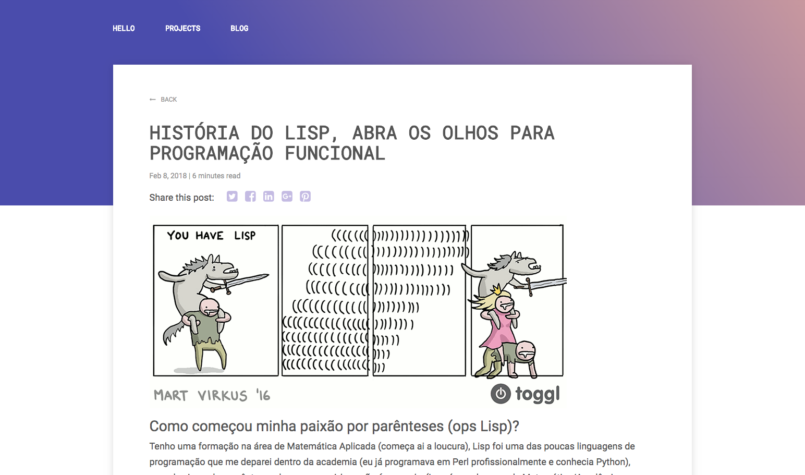

# hugo-theme-sarah

Sarah theme for [Hugo](https://gohugo.io/) static site generator

## Screenshots

### Home


### Projects


### Blog

#### Latest Posts


#### Blogpost



## Installation

Inside the folder of your Hugo site run:

```bash
mkdir themes
cd themes
git clone https://github.com/avelino/hugo-theme-sarah.git
```

For more information read the official [setup guide](https://gohugo.io/getting-started/installing/) of Hugo.

## config.toml

### Nodes

#### [params]

| key | description |
| --- | --- |
| author | Author name |
| keywords | Keywords list |
| avatar | Author picture |
| dateform | Date format ([read more](https://discourse.gohugo.io/t/date-time-format-in-config-toml/5268/2)) |
| lang | Language that the main content will be written |
| footertext | Text at the end of the page (All rights reserved) |
| googleAnalytics | Google Analytics ID |
| about | Author text, show on homepage |

#### [params.social]

| key | description |
| --- | --- |
| linkedin | Account name |
| twitter | Account name |
| github | Account name |
| googleplus | Account name |
| facebook | Account name |

#### [[params.info]]

| key | description |
| --- | --- |
| label | Label |
| value | Valeu |
| link | Hyperlink |

#### [[params.projects]]

| key | description |
| --- | --- |
| name | Project name |
| desc | Project description |
| img | Image path (starting `static/`) |
| link | Hyperlink |

### Example

Show example in [exampleSite](https://github.com/avelino/hugo-theme-sarah/blob/master/exampleSite/config.toml)

```toml
baseURL = "http://avelino.xxx/"
languageCode = "en-us"
title = "Avelino"
theme = "sarah"

[permalinks]
fixed = ":title/"
blog  = ":slug"

[params]
author = "Avelino"
keywords = ["Golang (Gopher)", "Neural Network", "Artificial Intelligence"]
avatar = "img/black-250.png"
dateform = "Jan 2, 2006"
lang = "en"
footertext = "written by avelino"
googleAnalytics = "UA-3063031-15"
about = """
I’m a currently a Chief Technology Officer (and founder) at [Nuveo](https://nuveo.ai/) (**Artificial Intelligence** within reach) and mathematician formed at [IME-USP](https://www.ime.usp.br/).

Work day-to-day with **artificial intelligence, neural network and computer vision**. With the need to process large dataset its focus of research and development include **distributed systems, competition, Lisp, Golang and Python**.
"""

[params.social]
linkedin      = "avelino0"
twitter       = "avelino0"
github        = "avelino"

[[params.info]]
label = "Address"
value = "Brazil, São Paulo, SP"

[[params.projects]]
name = "Vim Bootstrap"
desc = "A generator which provides a simple method of generating a .vimrc configuration for vim"
img = "img/vimbootstrap.png"
link = "https://vim-bootstrap.com/"

[[params.projects]]
name = "Awesome Go"
desc = "A curated list of awesome Go frameworks, libraries and software"
img = "img/awesomego.png"
link = "https://awesome-go.com/"
```

## Contribute

### Build SCSS

```bash
npm install .
gulp build
```
